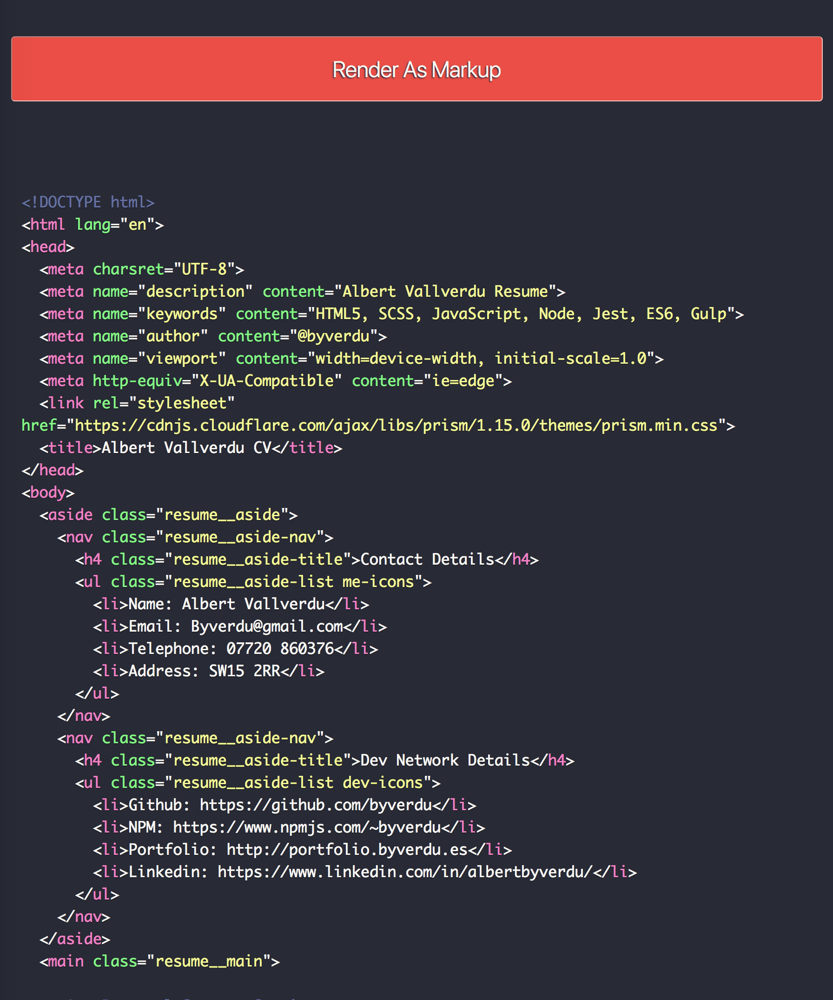

# Online Version for my CV

My Curriculum Vitae online 

### Why?

As a front end developer that I am I do not believe that a simple `.doc` file is the best way to show the skills that you have. For me, in this tech era that we are living makes more sense having something different than the average. 

This CV is done using [Prismjs](https://prismjs.com/index.html) and Github pages.

P.S. If you fancy or need one I can provide it but don't expect any fancy.

