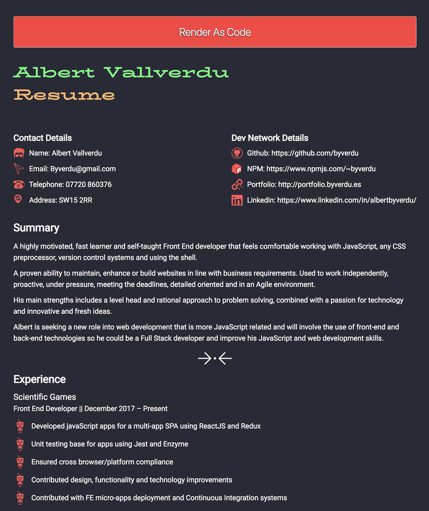

# Online Version for my CV

My Curriculum Vitae online 

### Why?

A different way to present your Curriculum Vitae

This CV is done using [Prismjs](https://prismjs.com/index.html) and Github pages.

## How it looks as syntax highlighted 

## How it looks as rendered content 

